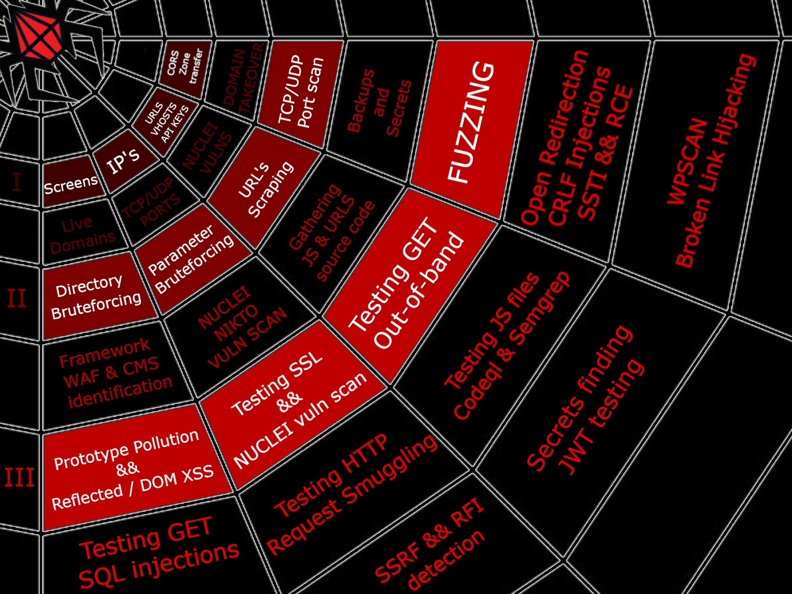

# Crimson v2

> Crimson is a tool that automates `ASSET DISCOVERY` and `VULNERABILITY SCANNING`.  
> It uses many open source tools, most of them are available for download from github.

<p align="center">
  
</p>

#### It consists of three partially interdependent modules:
* `crimson_recon`   - automates the process of subdomain reconnaissance and vulnerability scanning.
* `crimson_target`  - automates the process of single-domain reconnaissance and vulnerability scanning.
* `crimson_exploit` - automates the process of bug founding in gathered URLS.

# Installation & running
```
# 1. Pull docker container:
docker pull karmaz95/crimson:v2
# 2. First run of downloaded container:
docker run --net="host" --name crimson -it karmaz95/crimson:v2
# 3. After the first run, you can start the container by:
docker start crimson && docker attach crimson
# 4. If you need to copy output from container:
docker cp crimson:/root/bounty/domain.name <local-dest-path>
```
Additionally you can install Burp Suite and extensions listed below in section `Burp Suite extensions`.
# Usage - commands issued inside a docker container
##### :diamonds: First module needs `domain name`:diamonds:

```bash
crimson_recon -D "domain.com" 
                   
                   # Optional flags are shown below: 
                -x # Domain bruteforcing (with words/dns wordlist)
                -v # Virtual host discovering
                -p # TCP ports scanning (1-65535)
                -u # UDP ports scanning (nmap default ports)
                -b # Third level subdomain bruteforcing
                -y # Proxy urls.txt and live.txt to Burp (127.0.0.1:8080)
                -s # Find hidden subdomains and secrets within urls.txt with SubDomainizer (takes very long time)
```

 
##### :diamonds: Second module needs `subdomain name`:diamonds:
```bash
crimson_target -D "example.domain.com" 
                    
                    # Optional flags are shown below:
                 -c "Cookie: auth1=123;"
                 -p # TCP (1-65535)   ports scanning
                 -u # UDP (nmap default) ports scanning
                 -a # Without this flag, you have to manually check for false-positives after bruteforcing
                 -y # Proxy urls.txt and ffuf.txt to Burp (127.0.0.1:8080)
                 -b # Parameter bruteforcing with Arjun
```

##### :diamonds: Third module needs `subdomain name` with your `collaborator` and `vps ip`:diamonds:

```bash
crimson_exploit -D "example.domain.com" -d "collaborator.com" -i "ip"
                    
                    # Optional flags are shown below:
                  -c "Cookie: auth1=123;"
                  -x # fuzzing all.txt with bug wordlist
```

##### :diamonds: Before starting third module, run the listener on your vps machine on port 80 `python -m http.server 80` and for ping payloads `tcpdump -i eth0 icmp`:diamonds:

# Usage - modules description

<p align="center">
  
</p>

#### :small_red_triangle_down: [I] crimson_recon
> This module can help you if you have to test big infrastructure or you are trying to earn some bounties in `*.scope.com` domain.

```
### FUNCTIONS:
#
# 1. SUBDOMAIN ENUMERATION
# 2. LIVE SUBDOMAIN CHECK
# 3. TAKEOVER CHECK
# 4. SCREENSHOTS
# 5. CORS CHECK
# 6. IP RESOLVE
# 7. OPENED PORTS SCAN
# 8. URLS SCRAPING
# 9. API KEYS SCRAPING
# 10. VIRTUAL HOSTNAMES ENUMERATION
# 11. NUCLEI VULN SCAN
#
### LISTS (output):
#
# 1. live.txt           - LIVE SUBDOMAINS
# 2. ip.txt             - ALL IPs
# 3. ports.txt          - OPENED PORTS
# 4. subjack.txt        - VULNS [TAKEOVER]
# 5. screenshots        - STATUS CODES + SCREENS
# 6. cors_scan.txt      - VULNS [CORS]
# 7. urls.txt           - ALL CRAWLED AND LIVE URLS IN ONE FILE
# 8. status_live.txt    - HTTPS / HTTPS SUBDOMAINS STATUS CODES
# 9. ldns-walk.txt      - DOMAINS FROM DNSSEC
# 10. subdomainizer.txt - DETECTED API KEYS / AND MORE SUBDOMAINS
# 11. hosthunter.txt    - VIRTUAL HOSTNAMES
# 12. nuclei.txt        - CVE SCAN
#
### WORKFLOW
#
# 1. Start Burp Suite - optional step
# - Create new project - example.tld
# - Turn off interception
# 2. Start this script.
# 3. Check the output listed above (LISTS)
# 4. Select single domain and start crimson_target module
#
###
```

#### :small_red_triangle_down: [II] crimson_target
> This module covers one particular subdomain/domain for example : `www.scope.tld`.  
```
### FUNCTIONS:
#
# 1. FULL RANGE PORT SCANING && NSE ON OPENED PORTS
# 2. VULNERABILITY SCANING
# 3. DOMAIN CRAWLING
# 4. DIRECTORY BRUTEFORCING
# 5. GATHERING SOURCE CODE OF SCRAPED / BRUTEFORCED URLS
# 6. EXTRACTING NEW PATHS, API KEYS, ENDPOINTS FROM GATHERED SOURCE CODE
# 7. MERGING PATHS WITH DOMAIN AND PROBING FOR NEW ENDPOINTS
# 8. PROXING LIVE RESULTS TO BURP SUITE  
# 9. PREPARING params.txt && dirs.txt FOR EXPLOIT MODULE
# 10. CHECK WAF && POTENTIAL BACKUP FILES && CMS
# 11. TESTING HOP-BY-HOP DELETION
#
### LISTS:
#
# 1) recon.txt          - FILE WITH RECON OUTPUT
# 2) urls.txt           - FILE WITH GATHERED URLS
# 3) status_params.txt  - STATUS CODES OF urls.txt
# 4) ffuf.txt           - DIR BRUTEFORCING OUTPUT
# 5) status_dir.txt     - STATUS CODE OF ffuf.txt
# 9) exp/params.txt     - FILE PREPARED FOR crimson_exploit WITH PARAMS
# 10) exp/dirs.txt      - FILE PREPARED FOR crimson_exploit WITH DIRECTORIES
# 11) backups.txt       - POTENTIALLY BACKUP FILES 
# 12) arjun.txt         - FILE WITH BRUTEFORCED PARAMETERS
# 13) nmap.txt          - FILE WITH TCP/UDP PORT SCANNING OUTPUT
# 15) exp/nmap.gnmap    - FILE WITH TCP/UDP PORT SCANNING OUTPUT IN GREPABLE FORMAT 
#
### WORKFLOW
#
# 0. Start Burp - optional step
#   - Create new project - www.example.tld
#   - Turn off interception
#   - Make active scan for proxied urls only in scope
# 1. Start the script
#   - If you didn't choose -a flag, go to /bounty/domain.tld/tested.domain.tld/temp and remove manually false positives entries in ferox.txt
# 2. Check the output listed above (LISTS)
# 3. Manually browse the application, click on all functionalities
# 4. Copy whole target scope from Burp after manually browsing the target
# 5. Paste it to exp/all.txt and run crimson_exploit
#
###
```
#### :small_red_triangle_down: [III] crimson_exploit
> This module uses a number of tools to automate the search for certain bugs in a list of urls.
```
### FUNCTIONS:
#
# 1. FUZZING PATHS IN URLS FROM dirs.txt WITH CUSTOM PAYLOADS
# 2. FUZZING PARAMS IN URLS FROM params.txt WITH CUSTOM PAYLOADS
# 3. TESTING FOR XSS
# 4. TESTING JAVASCRIPT SOURCE CODE
# 5. TESTING HTTP REQUEST SMUGGLING
# 6. TESTING PROTOTYPE POLLUTION
# 7. TESTING FOR BROKEN LINKS
# 8. TESTING SQLI
# 9. TESTING OUT-OF-BOUND RCE/SSRF
# 10. TESTING JAVA DESERIALIZATION
# 11. TESTING CRLF INJECTION
# 12. TESTING FOR OPEN REDIRECTION
# 13. TESTING WORDPRESS
# 14. TESTING CVES
# 15. TESTING HEADER INJECTIONS
#
### LISTS:
#
# 1. bug_params.txt         - Fuzzing output
# 2. bug_dirs.txt           - Fuzzing output
# 3. vuln_xss               - Output from XSSstrike with vulnerable urls ready to open in browser
# 4. codeql.txt             - Output from Codeql after testing the JavaScript source code.
# 5. smuggler.txt           - Output after testing for HTTP request smuggling.
# 6. prototype-pollution    - Potentailly vulneable params to prototype pollution.
# 7. broken_links.txt       - Output from BLC
# 8. sqli/                  - Output from sqlmap
# 9. oob.txt                - Log after OAST  
# 10. CRLF.txt              - Output from crlfuzz
# 11. OR.txt                - Potentailly vulnerable URLS to Open Redirect vulnerability
# 12. dalfox.txt            - Output from dalfox
# 13. ssti.txt              - Output from crimson_templator with SSTI vulnerable urls.
# 14. wp/                   - Output from WPSCAN
# 15. deserializator.txt    - Logs from crimson_deserializator 
# 16. semgrep.txt           - Output from semgrep after testing the JavaScript source code.
# 17. nuclei.txt            - Output from nuclei scanning
# 18. headi.txt             - Otput from headi
#
### WORKFLOW
#
# 0. Start BURP - optional step
# 1. Start vps listener and collaborator server
# 2. Start the script
# 3. Check the output listed above (LISTS)
# 5. Look for [ID] [TIME] in oob.txt and compare it to pings on your vps / collaborator
# 8. Check deserialization pings with manual payloads
# 9. Start manual testing 
#
###
```
# Extras
> There are some useful tools in the scripts directory that I have written that are worth checking out.

# Contributing
> Pull requests are welcome. For major changes, please open an issue first to discuss what you would like to change.

# List of utilized tools
> The following tools are used in `crimson`. I encourage you to study the links below, they will definitely help you in your work.
> Especially check `Burp Suite extensions`, because all gathered resources are proxied to Burp Suite, where they are further tested.


### :diamonds: Domains enumeration:
* [Amass](https://github.com/OWASP/Amass)
* [subfinder](https://github.com/projectdiscovery/subfinder)
* [massdns](https://github.com/blechschmidt/massdns)
* [dnsx](https://github.com/projectdiscovery/dnsx)
* [assetfinder](https://github.com/tomnomnom/assetfinder)
* [SubDomainizer](https://github.com/nsonaniya2010/SubDomainizer)
* [puredns](https://github.com/d3mondev/puredns)
* [sudomy](https://github.com/Screetsec/Sudomy)
* [altdns](https://github.com/infosec-au/altdns)
* [HostHunter](https://github.com/SpiderLabs/HostHunter/)

### :diamonds: IP && ports:
* [nmap](https://github.com/nmap/nmap)
* [masscan](https://github.com/robertdavidgraham/masscan)
* [rustscan](https://github.com/RustScan/RustScan.git)

### :diamonds: URLs:
* [waybackurls](https://github.com/tomnomnom/waybackurls)
* [Paramspider](https://github.com/devanshbatham/ParamSpider)
* [getallurls](https://github.com/lc/gau)
* [wfuzz](https://github.com/xmendez/wfuzz)
* [ffuf](https://github.com/ffuf/ffuf)
* [feroxbuster](https://github.com/epi052/feroxbuster)
* [sitemap-urls](https://github.com/yuriyyakym/sitemap-urls)
* [gospider](https://github.com/jaeles-project/gospider)
* [hakrawler](https://github.com/hakluke/hakrawler)
* [galer](https://github.com/dwisiswant0/galer)
* [getJS](https://github.com/003random/getJS)
* [httpx](https://github.com/encode/httpx)
* [zile](https://github.com/Karmaz95/crimson/tree/master/scripts/zile)
* [relative-url-extractor](https://github.com/jobertabma/relative-url-extractor)
* [crimson_backuper](https://github.com/Karmaz95/crimson/blob/master/scripts/crimson_backuper.py)

### :diamonds: Target visualisation:
* [WhatWeb](https://github.com/urbanadventurer/WhatWeb)
* [gowitness](https://github.com/sensepost/gowitness)
* [wafw00f](https://github.com/EnableSecurity/wafw00f)
* [webanalyze](https://github.com/rverton/webanalyze)
* [cf-check](https://github.com/dwisiswant0/cf-check)

### :diamonds: Bug finding:
* [nikto](https://github.com/sullo/nikto)
* [CorsMe](https://github.com/Shivangx01b/CorsMe)
* [subjack](https://github.com/haccer/subjack)
* [XSStrike](https://github.com/s0md3v/XSStrike)
* [Smuggler](https://github.com/defparam/smuggler)
* [hbh-header-abuse-test](https://gist.github.com/ndavison/298d11b3a77b97c908d63a345d3c624d)
* [broken-link-checker](https://github.com/stevenvachon/broken-link-checker)
* [sqlmap](http://sqlmap.org/)
* [CRLFuzz](https://github.com/dwisiswant0/crlfuzz)
* [ysoserial](https://github.com/frohoff/ysoserial)
* [ysoserial.net](https://github.com/frohoff/ysoserial)
* [jwt-tool](https://github.com/ticarpi/jwt_tool)
* [dalfox](https://github.com/hahwul/dalfox)
* [testssl.sh](https://testssl.sh/)
* [crimson_deserializator](https://github.com/Karmaz95/crimson/blob/master/scripts/crimson_deserializator.py)
* [crimson_oobtester](https://github.com/Karmaz95/crimson/blob/master/scripts/crimson_oobtester.py)
* [crimson_templator](https://github.com/Karmaz95/crimson/blob/master/scripts/crimson_templator.py)
* [nuclei](https://github.com/projectdiscovery/nuclei)
* [headi](https://github.com/mlcsec/headi)
* [codeql](https://github.com/github/codeql-cli-binaries)
* [semgrep](https://semgrep.dev/)
* [gmapiscanner](https://github.com/ozguralp/gmapsapiscanner.git)


### :diamonds: WordPress tools:
* [wpscan](https://github.com/wpscanteam/wpscan)
* [WPluginScanner](https://github.com/linoskoczek/WPluginScanner)
* [quickpress](https://github.com/pownx/quickpress)
* [wpBullet](https://github.com/webarx-security/wpbullet)


### :diamonds: Additional tools:
* [qsreplace](https://github.com/tomnomnom/qsreplace)
* [anew](https://github.com/tomnomnom/anew.git)
* [unfurl](https://github.com/tomnomnom/unfurl)
* [Search-That-Hash](https://github.com/HashPals/Search-That-Hash)
* [clever_ffuf](https://github.com/Karmaz95/crimson/blob/master/scripts/clever_ffuf.py)
* [crimson_opener](https://github.com/Karmaz95/crimson/tree/master/scripts/crimson_opener)
* [crimson_paramjuggler](https://github.com/Karmaz95/crimson/blob/master/scripts/crimson_paramjuggler.py)
* [tldextract](https://pypi.org/project/tldextract/)
* [PyWhat](https://github.com/bee-san/pyWhat)
* [Ciphey](https://github.com/Ciphey/Ciphey)
* [cswsh-scanner](https://github.com/ambalabanov/cswsh-scanner)


### :diamonds: Wordlists:
* [SecLists](https://github.com/danielmiessler/SecLists)
* [PayloadsAllTheThings](https://github.com/swisskyrepo/PayloadsAllTheThings)
* [fresh-resolvers](https://raw.githubusercontent.com/BonJarber/fresh-resolvers/)


### :diamonds: Burp Suite extensions:
* [ActiveScan++](https://portswigger.net/bappstore/3123d5b5f25c4128894d97ea1acc4976)
* [Anonymous Cloud, Configuration and Subdomain Takeover Scanner](https://portswigger.net/bappstore/ea60f107b25d44ddb59c1aee3786c6a1)
* [Attack Surface Detector](https://portswigger.net/bappstore/47027b96525d4353aea5844781894fb1)
* [Auth Analyzer](https://portswigger.net/bappstore/7db49799266c4f85866f54d9eab82c89)
* [AWS Security Checks](https://portswigger.net/bappstore/f078b9254eab40dc8c562177de3d3b2d)
* [Backslash Powered Scanner](https://portswigger.net/bappstore/9cff8c55432a45808432e26dbb2b41d8)
* [Burp Bounty Pro](https://burpbounty.net/)
* [Cloud Storage Tester](https://portswigger.net/bappstore/04adbe101f544c88b2497a9a25ffaab4)
* [Collaborator Everywhere](https://portswigger.net/bappstore/2495f6fb364d48c3b6c984e226c02968)
* [CSRF Scanner](https://portswigger.net/bappstore/60f172f27a9b49a1b538ed414f9f27c3)
* [Detect Dynamic JS](https://portswigger.net/bappstore/4a657674ebe3410b92280613aa512304)
* [Error Message Checks](https://portswigger.net/bappstore/4f01db4b668c4126a68e4673df796f0f)
* [Freddy, Deserialization Bug Finder](https://portswigger.net/bappstore/ae1cce0c6d6c47528b4af35faebc3ab3)
* [HTTP Request Smuggler](https://portswigger.net/bappstore/aaaa60ef945341e8a450217a54a11646)
* [InQL - Introspection GraphQL Scanner](https://portswigger.net/bappstore/296e9a0730384be4b2fffef7b4e19b1f)
* [J2EEScan](https://portswigger.net/bappstore/7ec6d429fed04cdcb6243d8ba7358880)
* [Java Deserialization Scanner](https://portswigger.net/bappstore/228336544ebe4e68824b5146dbbd93ae)
* [JS Link Finder](https://portswigger.net/bappstore/0e61c786db0c4ac787a08c4516d52ccf)
* [NGINX Alias Traversal](https://portswigger.net/bappstore/a5fdd2cdffa6410eb530de5a4c294d3a)
* [NoSQLi Scanner](https://portswigger.net/bappstore/605a859f0a814f0cbbdce92bc64233b4)
* [Param Miner](https://portswigger.net/bappstore/17d2949a985c4b7ca092728dba871943)
* [PHP Object Injection Check](https://portswigger.net/bappstore/24dab228311049d89a27a4d721e17ef7)
* [Reflected Parameters](https://portswigger.net/bappstore/8e8f6bb313db46ba9e0a7539d3726651)
* [Retire.js](https://portswigger.net/bappstore/36238b534a78494db9bf2d03f112265c)
* [Similar Request Excluder](https://portswigger.net/bappstore/9ecd51851baf4ae6b69c6a951257387a)
* [Software Version Reporter](https://portswigger.net/bappstore/ae62baff8fa24150991bad5eaf6d4d38)
* [Software Vulnerability Scanner](https://portswigger.net/bappstore/c9fb79369b56407792a7104e3c4352fb)
* [Taborator](https://portswigger.net/bappstore/c9c37e424a744aa08866652f63ee9e0f)
* [Turbo Intruder](https://portswigger.net/bappstore/9abaa233088242e8be252cd4ff534988)
* [UploadScanner](https://portswigger.net/bappstore/b2244cbb6953442cb3c82fa0a0d908fa)
* [Web Cache Deception Scanner](https://portswigger.net/bappstore/7c1ca94a61474d9e897d307c858d52f0)
* [Hackvertor](https://portswigger.net/bappstore/65033cbd2c344fbabe57ac060b5dd100)
* [burp-copy-as-ffuf](https://github.com/d3k4z/burp-copy-as-ffuf)


### :diamonds: OSINT:
* [spiderfoot](https://github.com/smicallef/spiderfoot.git)
* [theHarvester](https://github.com/laramies/theHarvester.git)


### :diamonds: TO DO:
* [gorgo](https://github.com/pry0cc/gorgo)
* [cariddi](https://github.com/edoardottt/cariddi)
* [crawlergo](https://github.com/Qianlitp/crawlergo)
* [svn-extractor](https://github.com/Karmaz95/svn-extractor)
* [PoC-in-GitHub](https://github.com/nomi-sec/PoC-in-GitHub)
* [S3Scanner](https://github.com/sa7mon/S3Scanner)


# HISTORY
> If you are curious how it all started:
* You can learn more about `crimson_recon` module by reading my article at [medium](https://karol-mazurek95.medium.com/automation-of-the-reconnaissance-phase-during-web-application-penetration-testing-i-574fd9dce53e)
* You can learn more about `crimson_target` module by reading my article at [medium](https://karol-mazurek95.medium.com/automation-of-the-reconnaissance-phase-during-web-application-penetration-testing-ii-4336bd4ca73b?sk=ba289442112704cd71ac4a89e994fc8c)
* You can learn more about `crimson_exploit` module by reading my article at [medium](https://karol-mazurek95.medium.com/automation-of-the-reconnaissance-phase-during-web-application-penetration-testing-iii-2823b16f38cc)

# LICENSE
> This program is free software: you can redistribute it and/or modify it under the terms of the [Apache license](https://choosealicense.com/licenses/apache-2.0/). Crimson and any contributions are Copyright © by Karol Mazurek 2020-2022.

# SUPPORT
> You can support the project by buying me a coffee or via [NFT](https://opensea.io/assets/matic/0x2953399124f0cbb46d2cbacd8a89cf0599974963/63545429842149574507305116647116186975620361263604520406486432940112228647212/) which unlock the secret Crimson Web community.

<a href="https://www.buymeacoffee.com/karmaz95" target="_blank"></a>
